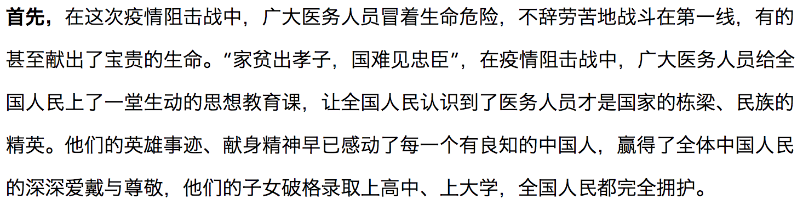
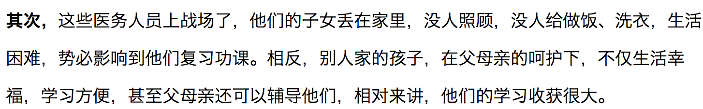
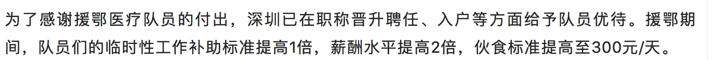

# 是否给医护子女加分，我们到底该是什么态度？

是否给医护子女加分，社会舆论产生严重的分歧，公说公有理婆说婆有理！我们不妨换种角度看下，或许柳暗花明又一村！。
赞成观点：冒着生命危险，服务人民，理应得到回报。

赞成的观点很鲜明，疫情期间，大家都躲在家里刷手机，但是医护人员仍然要奔赴前线，到最危险的地方去为人民服务。加分，太应该加分了！
  

反对观点：莫不为“公平”二字，医护之间的公平，全体考生的公平。
  
  

两方观点都是振振有词，谁也说服不了谁。

首先我们来看先我国的加分政策。

## 历史沿革

1、1978 年前主要实行“优先录取”政策。
"参加工作 3 年以上的革命干部和革命军人、兄弟民族学生以及华侨学生，考试成绩虽差，得从宽录取。"
这里虽然是只是说特定人群从宽录取，但是在 1978 年前，饭都吃不饱的时代，教育资源极其有限。然而革命干部和革命军人已经相当大比率了，可以说非此类人群，就不要想读大学了。那时候能读大学的人都是父辈，甚至是祖辈就是有一定背景的人。
那个时代，读大学基本都是“红二代”的特权，也诞生了很多对中国科技做出突出贡献的“红二代”，

2、2009 年前则主要实行“加分录取”政策。

国家加大了人才选拔的力度，不再对工农成分学生及革命干部子女进行照顾，而是对三好学生、学科竞赛获奖者、体育艺术特长生等实行高考分数优惠政策。

这个时候已经慢慢的淡化父辈的背景，转而主要看考生本人表现。

## 2009 年新政

教育部 2009 颁发的加分政策。主要有三项，分别为“增加 20 分投档”、“增加 10 分投档”和“优先录取”3 种加分形式。

1、 增加 20 分投档
a) 本人突出事迹，受到省级以上的表彰。
b) 本人全国中学生学科奥林匹克竞赛省赛区一等奖或全国决赛一、二、三等奖的考生。
c) 本人获得全国青少年科技创新大赛、“明天小小科学家”奖励活动及全国中小学电脑制作活动一、二等奖者。
d) 本人获得国际科学与工程大奖赛或国际环境科研项目奥林匹克竞赛中获奖者；
e) 本人获得国家一、二级运动员称号，全国运动比赛前 6 的考生。

    ps: 你会发现，如果加 20分，全部都是本人的表现。

2、 增加 10 分投档
考生包括少数民族考生、归侨及归侨子女、华侨子女、台湾籍考生以及烈士子女。
3、优先录取

现役的考生、残疾军人、因公牺牲军人的子女、一级至四级残疾军人等等，在与其他考生同等条件下享受优先录取。

PS: 同等条件下优先录取。

## 最新加分政策

依据《2019 年普通高等学校招生工作规定》  
1、有下列情形之一的考生，省级招委会可根据本地投档录取办法决定，在其统考成绩总分的基础上增加一定分数投档；达到高校投档条件的，由高校审查决定是否录取。同一考生如符合多项增加分数投档条件的，只能取其中幅度最大的一项分值，且不得超过 20 分。
（1）边疆、山区、牧区、少数民族聚居地区少数民族考生；
（2）归侨、华侨子女、归侨子女和台湾省籍考生；
（3）烈士子女。
2、自主就业的退役士兵，可在其统考成绩总分的基础上增加 10 分投档；在服役期间荣立二等功以上或被战区（原大军区）以上单位授予荣誉称号的退役军人，可在其统考成绩总分的基础上增加 20 分投档。

对比 2009 年的高考政策，有两大差异：  
1、个人表现已经不再加分(除了退役士兵)，比如体育竞赛，奥林匹克竞赛等。
2、家庭背景更重要了。比如，少数民族，华侨，烈士子女，由原来的增加 10 分，提高到增加 20 分。

如果回顾看整个【加分政策】的演变，会发现是这样的。

# 该不该给医护人员加分？

按照当前已有政策，给医护人员加分，显然违背了教育部颁发的加分政策。既不是边疆等少数名族，也不是华侨同胞，当然不是退役士兵。

显然，对于逆行而上，为人民服务而牺牲的医护人员，应该授予烈士，合情合理合法！
那么对于烈士子女，最高 20 分的高考加分政策，我认为应该支持。

显然，黑龙江并未指明是最高 20 分投档，但是牺牲医护，追为烈士，子女享受最高 20 分的加分政策，我认为应该支持。

但是对于安然无恙的医护人员，再加分，请问是设么逻辑？

1、于法：没有这么的文件，无法归纳到哪一条可以加分。
2、于情：医护人员在一线政府给与了各方面的奖励了，比如深圳已经明确给与特殊关怀。

3、于理：如果安全返回的医护人员子女仍然可以加分，那么当前所有的人民军队的子女也应该都加分，牺牲了军人，为烈士，加分，那么未牺牲的海外援助的军人，边疆极地防卫军人，冒火前进的消防士兵，哪个不是危险重重？

赞成加分的人不一定是没有子女参加高考，反对加分的人不一定是子女一定还要高考。
有时候，观点，并不是只着眼于利益，而是问心无愧
