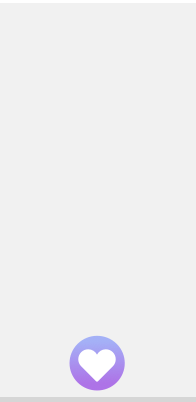
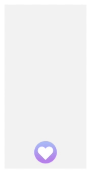
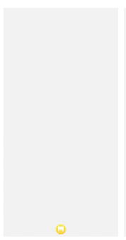
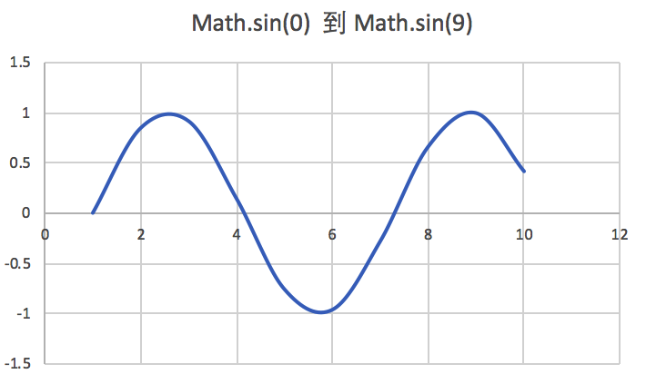
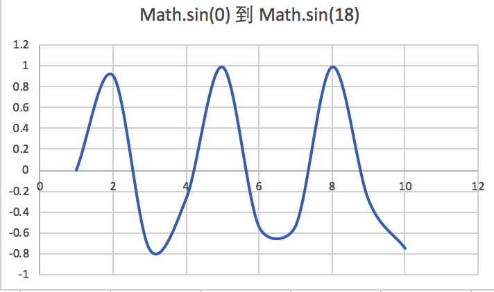
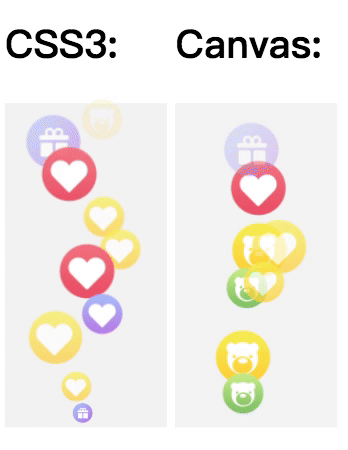

# H5 直播的疯狂点赞动画是如何实现的？

直播有一个很重要的互动：点赞。  

为了制造直播间的氛围，直播相对于普通视频或者文本内容，点赞通常有两个特殊需求：

- 点赞动作无限次，引导用户疯狂点赞
- 直播间的所有疯狂点赞，都需要在所有用户界面都动画展现出来

我们先来看效果图：


从效果图上我们还看到有几点重要信息：

- 点赞动画图片大小不一，运动轨迹也是随机的
- 点赞动画图片都是先放大再匀速运动。
- 快到顶部的时候，是渐渐消失。
- 收到大量的点赞请求的时候，点赞动画不扎堆，井然有序持续出现。

那么如何实现这些要求呢？下面介绍两种实现方式来实现：

## CSS3 实现

用 CSS3 实现动画，显然，我们想到的是用 animation 。

首先看下 animation 合并写法，具体含义就不解释了，如果需要可以自行了解。  
```css
animation: name duration timing-function delay iteration-count direction fill-mode play-state;
```

我们开始来一步一步实现。 

### Step 1: 固定区域，设置基本样式

首先，我们先准备 1 张点赞动画图片：  


看一下 HTML 结构。外层一个结构固定整个显示动画区域的位置。这里在一个宽 100px ,高 200px 的 div 区域。

```html
<div class="praise_bubble">
  <div class="bubble b1 bl1"></div>
</div>
```
```css
.praise_bubble{
  width:100px;
  height:200px;
  position:relative;
  background-color:#f4f4f4;
}
.bubble{
    position: absolute;
    left:50%;
    bottom:0;
}
```


### Step 2: 运动起来

使用 animation 的帧动画，定义一个 bubble_y 的帧序列。

```css
.bl1{
    animation:bubble_y 4s linear 1 forwards ; 
 }
@keyframes bubble_y {
    0% {
        margin-bottom:0;
    }
    100% {
        margin-bottom:200px;
    }
}
```

这里设置运行时间 4s ;  
采用线性运动 linear，如果有需求当然也可以使用其他曲线，比如 ease;  
每个点赞动画只运行 1 次;   
动画是只需要向前 forwards。



### Step 3: 增加渐隐

渐隐效果，使用 opacity 即可。这里我们固定在最后 1/4 开始渐隐。
修改 bubble_y:
```css
@keyframes bubble_y {
    0% {
        margin-bottom:0;
    }
    75%{
        opacity:1;
    }
    100% {
        margin-bottom:200px;
        opacity:0;
    }
}
```


### Step 4: 增加动画放大效果

在最开始一小段时间，图片由小变大。  

于是我们新增一个动画：bubble_big_1。

这里从 0.3 倍原图放大到 1 倍。这里注意运行时间，比如上面设置，从动画开始到结束总共是 4s，那么这个放大时间就可以按需设置了，比如 0.5s。

```css
.bl1{
    animation:bubble_big 0.5s linear 1 forwards; 
 }
@keyframes bubble_big_1 {
    0% {
        transform: scale(.3);
    }
    100% {
        transform: scale(1);
    }
  }
```


### Step 5: 设置偏移

我们先定义帧动画：bubble_1 来执行偏移。图片开始放大阶段，这里没有设置偏移，保持中间原点不变。

在运行到 25% * 4 = 1s，即 1s之后，是向左偏移 -8px, 2s 的时候，向右偏移 8px，3s 的时候，向做偏移 15px ,最终向右偏移 15px。

大家可以想到了，这是定义的一个经典的左右摆动轨迹，“向左向右向左向右” 曲线摆动效果。

```css
@keyframes bubble_1 {
    0% {
    }
    25% {
        margin-left:-8px;
    }
    50% {
        margin-left:8px
    }
    75% {
        margin-left:-15px
    }
    100% {
        margin-left:15px
    }
}
```

效果图如下：  


### Step 6: 补齐动画样式

这里预设了一种运行曲线轨迹，左右摆动的样式，我们在再预设更多种曲线，达到随机轨迹的目的。  

比如 bubble_1 的左右偏移动画轨迹，我们可以修改偏移值，来达到不同的曲线轨迹。

### Step 7: JS 操作随机增加节点样式

提供增加点赞的方法，随机将点赞的样式组合，然后渲染到节点上。
```js
let praiseBubble = document.getElementById("praise_bubble");
let last = 0;
function addPraise() {
    const b =Math.floor(Math.random() * 6) + 1;
    const bl =Math.floor(Math.random() * 11) + 1; // bl1~bl11
    let d = document.createElement("div");
    d.className = `bubble b${b} bl${bl}`;
    d.dataset.t = String(Date.now());
    praiseBubble.appendChild(d);
}
setInterval(() => {
    addPraise();
},300)
```
在使用 CSS 来实现点赞的时候，通常还需要注意设置 bubble 的随机延时，比如：

```css
.bl2{
    animation:bubble_2 $bubble_time linear .4s 1 forwards,bubble_big_2 $bubble_scale linear .4s 1 forwards,bubble_y $bubble_time linear .4s 1 forwards;   
}
```

这里如果是随机到 bl2，那么延时 0.4s 再运行，bl3 延时 0.6s ……

如果是批量更新到节点上，不设置延时的话，那就会扎堆出现。随机“ bl ”样式，就随机了延时，然后批量出现，都会自动错峰显示。我们还需要增加当前用户手动点赞的动画，这个不需要延时。

另外，有可能同时别人下发了点赞 40 个，业务需求通常是希望这 40 个点赞气泡都能依次出现，制造持续的点赞氛围，否则下发量大又会扎堆显示了。

那么我们还需要分批打散点赞数量，比如一次点赞的时间（$bubble_time）是 4s, 那么 4s 内，希望同时出现多少个点赞呢？比如是 10个，那么 40 个点赞，需要分批 4 次渲染。

```js
 window.requestAnimationFrame(() => {
     // 继续循环处理批次
     render();
 });
```

另外还需要手动清除节点。以防节点过多带来的性能问题。如下是完整的效果图。



## Canvas 绘图实现

这个很容易理解，直接在 canvas 上绘制动画就行，如果不了解 canvas 的，可以后续学习下。

### Step 1:初始化

页面元素上新建 canvas 标签，初始化 canvas。  

canvas 上可以设置 width 和 height 属性，也可以在 style 属性里面设置 width 和 height。

- canvas 上 style 的 width 和 height 是 canvas 在浏览器中被渲染的高度和宽度，即在页面中的实际宽高。
- canvas 标签的 width 和 height 是画布实际宽度和高度。

```html
<canvas id="thumsCanvas" width="200" height="400" style="width:100px;height:200px"></canvas>
```
页面上一个宽 200，高 400 的 canvas 画布，然后整个 canvas 显示在 页面 宽 100，高 200 的区域内。canvas 画布的内容被等比缩小一倍显示在页面。

定义一个点赞类，ThumbsUpAni，构造函数就是读取 canvas,保存宽高值。
```js
class ThumbsUpAni{
    constructor(){
        const canvas = document.getElementById('thumsCanvas');
        this.context = canvas.getContext('2d')!;
        this.width = canvas.width;
        this.height = canvas.height;
    }
}
```

### Step 2：提前加载图片资源

将需要随机渲染的点赞图片，先预加载，获得图片的宽高，如果有下载失败的，则不显示该随机图片即可。没啥说的，简单易懂。

```js
loadImages(){
    const images = [
        'jfs/t1/93992/8/9049/4680/5e0aea04Ec9dd2be8/608efd890fd61486.png',
        'jfs/t1/108305/14/2849/4908/5e0aea04Efb54912c/bfa59f27e654e29c.png',
        'jfs/t1/98805/29/8975/5106/5e0aea05Ed970e2b4/98803f8ad07147b9.png',
        'jfs/t1/94291/26/9105/4344/5e0aea05Ed64b9187/5165fdf5621d5bbf.png',
        'jfs/t1/102753/34/8504/5522/5e0aea05E0b9ef0b4/74a73178e31bd021.png',
        'jfs/t1/102954/26/9241/5069/5e0aea05E7dde8bda/720fcec8bc5be9d4.png'
    ];
    const promiseAll = [] as Array<Promise<any>>;
    images.forEach((src) => {
        const p = new Promise(function (resolve) {
            const img = new Image;
            img.onerror = img.onload = resolve.bind(null, img);
            img.src = 'https://img12.360buyimg.com/img/' + src;
        });
        promiseAll.push(p);
    });
    Promise.all(promiseAll).then((imgsList) => {
        this.imgsList = imgsList.filter((d) => {
            if (d && d.width > 0) return true;
            return false;
        });
        if (this.imgsList.length == 0) {
            logger.error('imgsList load all error');
            return;
        }
    })
}
```

### Step 2：创建渲染对象

实时渲染图片，使其变成一个连贯的动画，很重要的是：生成曲线轨迹。这个曲线轨迹需要是平滑的均匀曲线。
假如生成的曲线轨迹不平滑的话，那看到的效果就会太突兀，比如上一个是 10 px，下一个就是 -10px，那显然，动画就是忽左忽右左右闪烁了。

理想的轨迹是上一个位置是 10px,接下来是 9px，然后一直平滑到 -10px，这样的坐标点就是连贯的，看起来动画就是平滑运行。

### 随机平滑 X 轴偏移

如果要做到平滑曲线，其实可以使用我们再熟悉不过的正弦( Math.sin )函数来实现均匀曲线。

看下图的正弦曲线：  



这是 Math.sin(0) 到 Math.sin(9) 的曲线图走势图，它是一个平滑的从正数到负数，然后再从负数到正数的曲线图，完全符合我们的需求，于是我们再需要生成一个随机比率值，让摆动幅度随机起来。

```js
const angle = getRandom(2, 10);
let ratio = getRandom(10,30)*((getRandom(0, 1) ? 1 : -1));
const getTranslateX = (diffTime) => {
    if (diffTime < this.scaleTime) {// 放大期间，不进行摇摆偏移
        return basicX;
    } else {
        return basicX + ratio*Math.sin(angle*(diffTime - this.scaleTime));
    }
};
```
scaleTime 是从开始放大到最终大小，用多长时间，这里我们设置 0.1，即总共运行时间前面的 10% 的时间，点赞图片逐步放大。

diffTime，是只从开始动画运行到当前时间过了多长时间了，为百分比。实际值是从 0  --》 1 逐步增大。
diffTime - scaleTime = 0 ~ 0.9, diffTime 为 0.4 的时候，说明是已经运行了 40% 的时间。

因为 Math.sin(0) 到 Math.sin(0.9) 曲线几乎是一个直线，所以不太符合摆动效果，从 Math.sin(0) 到 Math.sin(1.8) 开始有细微的变化，所以我们这里设置的 angle 最小值为 2。

这里设置角度系数 angle 最大为 10 ，从底部到顶部运行两个波峰。

当然如果运行距离再长一些，我们可以增大 angle 值，比如变成 3 个波峰(如果时间短，出现三个波峰，就会运行过快，有闪烁现象)。如下图:



### Y 轴偏移

这个容易理解，开始 diffTime 为 0 ，所以运行偏移从 this.height --> image.height / 2。即从最底部，运行到顶部留下，实际上我们在顶部会淡化隐藏。

```js
const getTranslateY = (diffTime) => {
    return image.height / 2 + (this.height - image.height / 2) * (1-diffTime);
};
```

### 放大缩小

当运行时间 diffTime 小于设置的 scaleTime 的时候，按比例随着时间增大，scale 变大。超过设置的时间阈值，则返回最终大小。
```js
const basicScale = [0.6, 0.9, 1.2][getRandom(0, 2)];
const getScale = (diffTime) => {
    if (diffTime < this.scaleTime) {
        return +((diffTime/ this.scaleTime).toFixed(2)) * basicScale;
    } else {
        return basicScale;
    }
};
```

### 淡出

同放大逻辑一致，只不过淡出是在运行快到最后的位置开始生效。

```js
const fadeOutStage = getRandom(14, 18) / 100;
const getAlpha = (diffTime) => {
    let left = 1 - +diffTime;
    if (left > fadeOutStage) {
        return 1;
    } else {
        return 1 - +((fadeOutStage - left) / fadeOutStage).toFixed(2);
    }
};
```

## 实时绘制

创建完绘制对象之后，就可以实时绘制了，根据上述获取到的“偏移值”，“放大”和“淡出”值，然后实时绘制点赞图片的位置即可。  

每个执行周期，都需要重新绘制 canvas 上的所有的动画图片位置，最终形成所有的点赞图片都在运动的效果。

```js
createRender(){
    return (diffTime) => {
        // 差值满了，即结束了 0 ---》 1
        if(diffTime>=1) return true;
        context.save();
        const scale = getScale(diffTime);
        const translateX = getTranslateX(diffTime);
        const translateY = getTranslateY(diffTime);
        context.translate(translateX, translateY);
        context.scale(scale, scale);
        context.globalAlpha = getAlpha(diffTime);
        // const rotate = getRotate();
        // context.rotate(rotate * Math.PI / 180);
        context.drawImage(
            image,
            -image.width / 2,
            -image.height / 2,
            image.width,
            image.height
        );
        context.restore();
    };
}
```
这里绘制的图片是原图的 width 和 height。前面我们设置了 basiceScale，如果图片更大，我们可以把 scale 再变小即可。
```js
const basicScale = [0.6, 0.9, 1.2][getRandom(0, 2)];
```

## 实时绘制扫描器

开启实时绘制扫描器，将创建的渲染对象放入 renderList 数组，数组不为空，说明 canvas 上还有动画，就需要不停的去执行 scan，直到 canvas 上没有动画结束为止。

```js
scan() {
    this.context.clearRect(0, 0, this.width, this.height);
    this.context.fillStyle = "#f4f4f4";
    this.context.fillRect(0,0,200,400);
    let index = 0;
    let length = this.renderList.length;
    if (length > 0) {
        requestAnimationFrame(this.scan.bind(this));
    }
    while (index < length) {
        const render = this.renderList[index];
        if (!render || !render.render || render.render.call(null, (Date.now() - render.timestamp) / render.duration)) {
            // 结束了，删除该动画
            this.renderList.splice(index, 1);
            length--;
        } else {
            // 当前动画未执行完成，continue
            index++;
        }
    }
}
```
这里就是根据执行的时间来对比，判断动画执行到的位置了:  
```js
diffTime = (Date.now() - render.timestamp) / render.duration  
```
如果开始的时间戳是 10000，当前是100100，则说明已经运行了 100 毫秒了，如果动画本来需要执行 1000 毫秒，那么 diffTime = 0.1，代表动画已经运行了 10%。

## 增加动画

每点赞一次或者每接收到别人点赞一次，则调用一次 start 方法来生成渲染实例，放进渲染实例数组。如果当前扫描器未开启，则需要启动扫描器，这里使用了 scanning 变量，防止开启多个扫描器。

```js
start() {
    const render = this.createRender();
    const duration = getRandom(1500, 3000);
    this.renderList.push({
        render,
        duration,
        timestamp: Date.now(),
    });
    if (!this.scanning) {
        this.scanning = true;
        requestFrame(this.scan.bind(this));
    }
    return this;
}
```

### 保持不扎堆

当接收到大量的点赞数据，且连续多次点赞（直播间人气很旺的时候）。那么点赞数据的渲染就需要特别注意了，否则页面就是一坨一坨的点赞动画。且衔接不紧密。  

```js
thumbsUp(num: number) {
      if (num <= this.praiseLast) return;
      this.thumbsStart = this.praiseLast;
      this.praiseLast = num;
      if (this.thumbsStart + 500 < num)
        this.thumbsStart = num - 500;
      const diff = this.praiseLast - this.thumbsStart;
      let time = 100;
      let isFirst = true;
      if (this.thumbsInter != 0) {
        return;
      }
      this.thumbsInter = setInterval(() => {
        if (this.thumbsStart >= this.praiseLast) {
          clearInterval(this.thumbsInter);
          this.thumbsInter = 0;
          return;
        }
        this.thumbsStart++;
        this.thumbsUpAni.start();
        if (isFirst) {
          isFirst = false;
          time = Math.round(5000 / diff);
        }
      }, time);
    },
```
这里开启定时器，记录定时器里面处理的 thumbsStart 的值，如果有新增点赞，且定时器还在运行，直接更新最后的 praiseLast 值，定时器会依次将点赞请求全部处理完。  

定时器的延时时间 time 根据开启定时器的时候，需要渲染多少点赞动画来决定的，比如需要渲染 100 个点赞动画，我们将 100 个点赞动画分布在 5s 内渲染完。

- 对于热门直播，会同时渲染的动画很多，不会扎堆显示，且动画完全能衔接上，不停的冒泡点赞动画。  
- 对于冷门直播，有多余一个的点赞请求，我们能打散到 5s 内显示，也不会扎堆显示。


## End

两种方式渲染点赞动画都已经完成，完整源码，[源码戳这里](https://github.com/antiter/praise-animation) 。

源码运行效果图：



这里还可以体验线上点赞动画，[戳这里](https://wqs.jd.com/pglive/index.html)