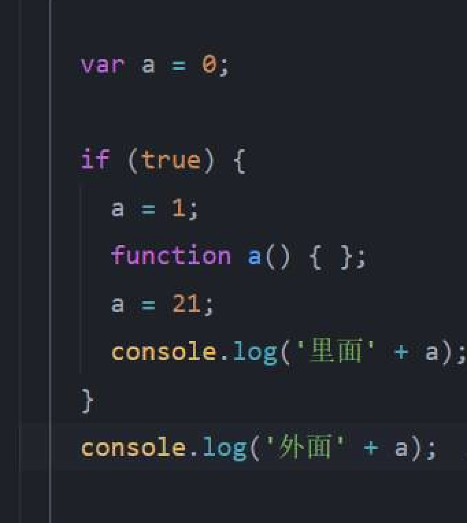
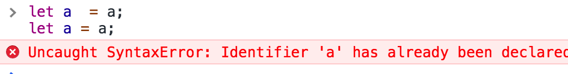

# 别高估自己，这道题，有点难！

今天在前端交流群里面，有朋友丢了一道题目，问这个输出是啥？  



粗略一看，输出都是 21 啊，你以为加个 if(true)，我就不知道了？

然后，没有然后了…………

“光荣”的答错了！

正确答案：内部是 21，外部是 1;   

其实，这个玄妙确实就在这个块级作用域 if 里面。

比如我们去掉 if 看题。
```js
var a = 0;
// if(true){
 a = 1;
function a(){}
a = 21;
console.log("里面",a);
// }
console.log("外部",a);
```

这道题估计没人好意思去问了，毫无疑问，输出的 a 都是 21 啊。

在 JS 里面都说没有块级作用域，那为啥 if 这个块会影响最终结果呢？  

本文主要点：

- 神奇的 let
- 函数块级作用域

## 什么是提升（Hosting）？  

JS 引擎会在解释 JavaScript 代码之前首先对代码进行预编译，预编译过程中的一部分工作就是找到所有的声明，并用合适的作用域将他们关联起来，这也正是词法作用域的内容。

主要分为变量提升和函数提升。

## 变量提升

变量的提升是以变量作用域来决定的，即全局作用域中声明的变量会提升至全局最顶层，函数内声明的变量只会提升至该函数作用域最顶层。

### 入门级
看题：
```js
console.log(a);
var a = 0;
```
这个并不会报： Uncaught ReferenceError: a is not defined。

而是会输出 undefined。

因为变量提升之后的结果是：  
```js
var a;
console.log(a);
a = 0;
```

### 进阶级

例子1：
```js
var x = 0;
function a(){
    console.log(x);
    let x = 1;
}
a();
```
如果 let x 不会变量提升的话，那么应该 x 输出 0，实际上是：

VM296:3 Uncaught ReferenceError: Cannot access 'x' before initialization
    at a (<anonymous>:3:14)
    at <anonymous>:1:1

它并不是报错 x not defined，而是 Cannot access。

那这个报错是啥原因呢？  

例子2： 
```js
let a = a;
let a = a;
```
你觉得会报什么错误呢？

“ a not defined ” 或者 “Cannot access 'a' before initialization”  ?

实际上都不是！  



这说明了： let 也会 “变量提升”，如果不会提升的话，例子1 的 x 应该输出 0 ,例子2 应该报错 a not defined。

但是如果会变量提升，那也说不过去呀， 那上面的例子1 应该输出 undefined 啊。  

于是我们管这叫 “暂时性死区”。

实际上这个既不是我们理解的变量提升，也不是没有变量提升。那什么是暂时性死区呢？

let 定义变量是有一个“特殊声明”的过程，JS 预解析的时候，先将定义的 let ,const “特殊声明”提前，类似“举手”，JS 引擎规定了同一个作用域，同一个变量只能被一次“举手”。

这里不同于 var 的定义和赋值，var 的声明是如果已经声明了，后者直接忽略声明。

我们继续回到本题目来看。

```js
let a = a; // 定义变量 a,我暂标识为 a1
let a = a; // 定义变量 a,我暂标识为 a2
```

浏览器预解析，将 a1 声明，然后准备将 a2 声明，这个时候，浏览器发现，声明 a2 的时候 ，已经有 a1 声明了，于是违反了 “同一个作用域，同一个变量只能被声明一次” 的规定，直接报错。实际上代码中赋值的 a 变量还没读取（在读取变量的时候才可能抛变量未定义的错误）。

所以，报错了，错误内容：a2 已经被声明了（被 a1 声明了 a）。

所以回到上述例 1，代码在读取 x 的时候，发现已有 let 声明的 x ，但是并未初始化，才直接报错 x 无法访问。

那么 let 变量“特殊声明”是一个什么神奇的东西呢？  

实际上是浏览器为了解决这个 let 变量提升时引入的 declareData, 在预解析的时候，里面存储了作用域里面所有的 let 和 const 声明数据。

事实上，作用域内所有的函数和变量的创建都需要校验是否与 declareData 的值冲突。  

例子 3： 
```js
var a = 1;//定义变量 a,我暂标识为 a1
let a = 2;//定义变量 a,我暂标识为 a2
```

declareData 声明变量 a2，然后准备定义变量 a1，发现 declareData 已经有声明 a2 了，直接报错： a1 已经被声明了，因为已经由 a2 声明了变量 a 。

## 函数提升

函数提升，类似变量提升，但是确有些许不同。

### 函数表达式
```js
console.log(a);// undfined
var a = function (){}

console.log(a); // function a
function a(){}
```
函数表达式不会声明提升，第一个例子输出的是 undefined 而不是 not defined，是因为中了变量 var a 的变量提升。

### 块级作用域

```js
console.log(a);// undefined
if(true){
    console.log(a); // function a
    function a(){}
}
```
如果是变量提升，是不存在块级作用域的，但是函数提升是存在的，这个预解析如下：

```js
var a; //  函数 a 的声明
console.log(a);// undefined
if(true){
    function a(){} // 函数 a 的定义
    console.log(a); // function a
}
```
其实函数 function a(){} 在经过预解析之后，将函数声明提到函数级作用域最前面，然后将函数定义提升到块级作用域最前面。

注意：这里的函数定义是提升到块级作用域最前面。

再看一题： 
```js
try{
    console.log(a);// undefined
    aa.c;
}catch(e){
    var a = 1;
}
console.log(a);// 1
console.log(e);// Uncaught ReferenceError: e is not defined
```
在 catch 里面定义的 a，被声明提前了。但是 catch 里面的 e 在外部无法访问。
如果你认为 catch 是一个“函数作用域”，那么里面的 a 不应该被提升到最外层。实际上 catch 里面遵循的是块作用域。

在 JS 领域内，本身是存在块级作用域的（let const 之外）。

## 再看原题

为了方便阅读，我再贴一下题目：

```js
var a = 0;
if(true){
    a = 1;
    function a(){}
    a = 21;
    console.log("里面",a);
}
console.log("外部",a);
```
结合上面我们了解到的知识。首先，if 里面的 function a(){} 会声明提升，将声明" var a" 移到函数级作用域最前面，将函数定义移到块级作用域最前面，预解析如下：   
```js
var a;// 函数 a 的声明提前
var a = 0;  // 已经声明了 a，这里会忽略声明 ,直接赋值为 0
if(true){
    function a(){} // 函数定义 a 声明提升到块级最前面
    a = 1; // 这里将 块级作用域最前面的函数 a 重置为 1了。
    // function a(){};  how do ？
    a = 21;
    console.log("里面",a);
}
console.log("外部",a);
```
这里还有一个问题，函数本身是【 定义函数名变量 指针指向 函数内存块】。  

函数提升是在块级作用域，但是函数名变量是函数级别的作用域。所以在块级的函数定义（原始代码函数的声明位置）的时候，会将函数名变量同步到函数级作用域，实际上，只有这个时候，在块级作用域外才能访问到函数定义。

比如：
```js
var a = 0;
if(true){
    console.log(a,window.a);// 函数提升，是块级作用域，输出 function a 和 0
    a = 1;  // 取作用域最近的块级作用域的 function a ,且被重置为 1了，本质又是一个 变量的赋值。
    console.log(a,window.a);// a 是指向块级作用域的 a, 输出 1 和 0 
    function a(){} // 函数的声明，将执行函数的变量的定义同步到函数级的作用域。
    console.log(a,window.a);// 输出 1 和 1
    a = 21; // 仍然是函数定义块级作用域的 a ,重置为 21
    console.log(a,window.a); // 输出为函数提升的块级作用域的 a, 输出 21，1
    console.log("里面",a);
}
console.log("外部",a);
```

到此为止，应该都理解了吧，再也不会答错了吧！如果不理解，再多看几遍试试。
