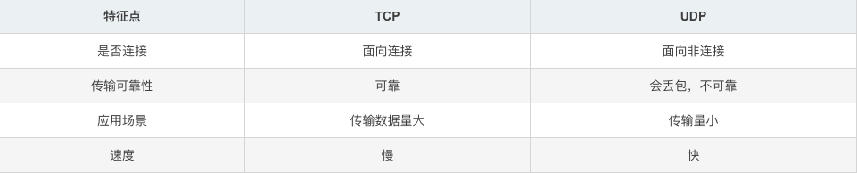
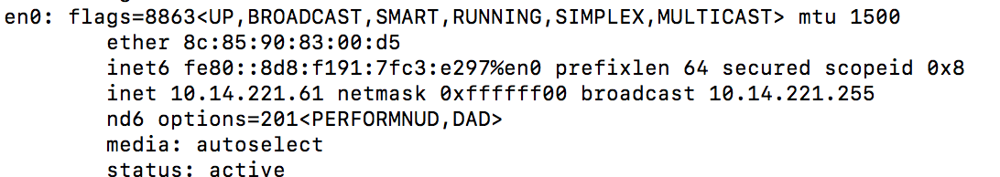

# UDP 数据报实现 Node 服务日志归集

日志归集：顾名思义，就是把日志归集起来。  

在开发 node 服务的时候，我们经常会打印各种日志，比如 info, error 日志。  

如果我们服务已经部署了很多机器上，如果需要查询昵称为”张三“的日志流水，那就很痛苦了，机器越多越难搞，因为不知道他的日志流水到底在哪一台，甚至可能还分散在多台服务器。因此，我们需要做日志归集，这样我们在一台机器上就可以查看所有的日志了。

本文目录： 

- 使用 dgram 实现日志归集
- UDP 数据包 和 Unix 数据报
- dgram 更多了解

## 第一步：收集日志

我们服务是部署在多台服务器上，每台机器上会打印日志，首先我们需要把日志拿到。一般有两种实现方式。

### 使用日志 logger 组件

如果整个系统日志输出，我们是使用统一的自定义 logger 组件，比如执行 logger.info(), logger.error() 来输出日志的话。那么我们就很容易收集日志了，直接在 logger 的 info , error, warn 等方法收集即可。

比如如下，在 logger 日志对象里面，增加存储到 logList 临时对象里面。
```js
const logList=[];
['info','warn','error'].forEach((type)=>{
    this[type] = ()=>{
        // do something
        logList.push({type:type,data:Array.from(arguments).join(" ")});
    }
});
```
这里我们需要存起来，是为了数据能批量发送，在指定的间隔时间（比如 1s）,发送一次日志，而不是没执行一次 log，就需要发送一次请求。

### 扫描文件上报

有些使用了第三方框架，写日志，并不是经过我们自定义的 logger 组件，这个时候，我们可以采取读取文件的方式来收集数据。实现如下：
```js
const fsExtra = require('fs-extra');
// 监听文件 path 的变化
fsExtra.watchFile(path, (curr, prev) => {
    // 有时候响应不稳定，会触发两次，第二次触发的时候，对象里面的时间戳会相等，所以判断当前时间戳小于等于上一次时间戳可过滤多余的监听。
    if (curr.mtime <= prev.mtime) return;
    // 为了提高性能，我们采取只读的方式来 open
    fsExtra.open(path, 'r', function(error, fd) {
      if (error) {
        logger.error('open log error', error);
        return;
      }
      // 创建一个缓冲，长度为（当前文件大小-文件上一个状态的大小） 由于这里我们已经明确获取到长度了，所以创建buffer可以使用性能更好的 allocUnsafe
      buffer = Buffer.allocUnsafe(curr.size - prev.size);
      fsExtra.read(fd, buffer, 0, (curr.size - prev.size), prev.size, function(err, bytesRead, buffer) {
        if (err) {
          logger.error('read log error', error);
          return;
        }
        const data = buffer.toString();
        logList.push({data:data});
      });
    });
```
逻辑也比较简单，监听日志文件，如果需要监听文件夹，在可以使用 watch 。当监听到文件变更的时候，已只读的方式打开文件，然后使用 read 函数读取文件的从起始到结束为止的内容。

## 第二步：客户端发送 UDP 数据包

UDP 数据包的特点是无连接，结构简单，对系统资源消耗少。缺点是数据不保证正确，且数据包到达先后顺序不保证。

对于我们的日志归集，显然不需要保证正确，且先后顺序影响不大，我们在每一条数据消息里面携带发送消息客户端的时间戳即可。所以我们选择 UDP 数据包。

udp4 和 udp6 ,取决于我们服务器，对应我们熟悉的是 IPV4 和 IPV6。这里使用 udp4。
```JS
const dgram = require('dgram');
const clientSocket = dgram.createSocket('udp4');
// 原创 udp 日志服务器的 ip 和 port，可能会是配置下发的方式来确定。如果是明确的一台服务器，也可以写死。
let remoteUDPServerIP = 'xxx,xxx,xxx,xxx';
let remoteUDPServerPort = 'xxx';
// 当前 udp 服务的 ip
clientSocket.bind(7777);
setInterval(()=>{
    if(logList.length==0) return;
    const data = logList.join("\r\n");
    logList = [];
    clientSocket.send(data, 0, data.length, remoteUDPServerPort, remoteUDPServerIP);
},1000);

```
开启定时器，扫描存储的日志列表。通常来说，如果我们的日志数据 logList ，是由我们自己定义的 logger 获取的，那么我们需要先用数组存起来，然后定时发送 UDP 数据包到 server 服务器上，达到批量发送的目的，减少发送频率。

但是如果我们是使用读取文件的方式来拿到需要上报的日志的话，通常我们可以监听到文件变化然后直接上报即可，无需使用定时器发送，因为通常情况下，都会在写日志文件的时候，已经做了批量写入了（通常会是 1s 更新一次）。

## 第三步：服务器接受 UDP 数据包

使用 dgram 创建服务端，然后接受客户端发送的消息，最终写到统一的日志文件里面。

```js
const path = require("path");
const fsExtra = require('fs-extra');
const dgram = require('dgram');
const serverSocket = dgram.createSocket('udp4');

serverSocket.on('message', function(msg, rinfo){
  handleMsg(msg,rinfo.address);
});
// 服务端端口
serverSocket.bind(7777);

var fp = "./logs"+path.sep+path.sep+msg.type;
fsExtra.ensureDir(fp);

function handleMsg(msg,address){
    try{
        msg = typeof msg=="object"?JSON.parse(msg):{msg:msg};
    }catch(e){
        console.log(e);
    }
    if(!msg.type) msg.type="info";
    
    // 组装上报参数
    let filepath = fp+path.sep+ getDate()+".log";
    let content = [];
    content.push(getDate(true));
    content.push(address);
    content.push(typeof msg.msg=="object"?JSON.stringify(msg.msg):msg.msg);
    content.push('\r\n');
    // 写入日志文件
    fs.appendFile(filepath, content.join(" "), err=> {
        if(err){
            fs.appendFile(".logs/white-error.log", filepath+"\t"+msg, e=>{});
        }else{
            // report 
        }
    });
}
function getDate(time) {
	let date = new Date();
    if(time){
        let hour = date.getHours();
        let minute = date.getMinutes();
        let second = date.getSeconds();
        let miseconds = date.getMilliseconds();
        return  [hour, minute, second,miseconds].map(formatNumber).join(':');
    }
	let year = date.getFullYear();
	let month = date.getMonth() + 1;
	let day = date.getDate();
	let p = [year, month, day].map(formatNumber).join('-');
	return p;
}
function formatNumber(n) {
  n = n.toString();
  return n[1] ? n : '0' + n;
}
```
这里大伙看下应该能看到了。创建 7777 端口的服务。然后监听到消息，则立即写入文件。

## 第四步：查询日志

至此，我们就实现了一个简单的 UDP 数据包的日志归集能工。不管部署多少台服务器。我们只需要在 ./logs/ 目录下就可以查看日志了。执行 tail 命令就可以查看各个服务器归集过来的日志了，当然时间可能会有错乱，但是已每条消息的时间为准即可。

```bash
 $ tail -f logs/info/2020-04-07.log
```

以下是扩展学习

## UDP 数据包 和 Unix domain socket 数据报

UDP，全称 User Datagram Protocol, 即[用户数据报协议](https://www.ietf.org/rfc/rfc768.txt)。UDP 和 TCP 两者的具体差异就不罗列了，有兴趣可以去了解下。主要差异如下：



这里我们主要看和 unix 协议的差异。 

Unix domain socket 协议是 unix 服务器进程之间本地通信 IPC 的一种。
也提供了两套协议：字节流套接口（类似 TCP ）和数据报套接口（类似 UDP )。

unix 数据报套接口与 UDP 的区别主要在，Unix domain socket 只能做本机 IPC， UDP 可以是本机也可以是远程机器通信。

如果仅仅是本机通信的话，推荐直接使用 Unix domain socket。主要优势有以下两个：

- unix 协议的数据报不会出现丢失乱序的情况。
- unix 协议性能更优，不会跑到链路层，不会做数据报校验。

当然如果为了可扩展，后续迁移到不同的机器，也可以使用 UDP 来实现。

Unix 协议使用 unix-dgram 组件。

由于是本机通信，所以不需要端口和 IP, 直接使用文件系统表示的路径名来标识。比如 /path/to/socket 这个系统路径。如果需要创建多个 server, 则指定不同的路径即可。我们来看下具体的使用代码。

服务接收端：  
```js
const unix = require('unix-dgram');
const server = unix.createSocket('unix_dgram', function(buf) {
  console.log('received ' + buf);
});
server.bind('/path/to/socket');
```
客户发送端：
```js
const message = Buffer('ping');
const client = unix.createSocket('unix_dgram');
client.send(message, 0, message.length, '/path/to/socket');
```
也可以自行定义其他 EventsListener,
```js
const unix = require('unix-dgram');
const client = unix.createSocket('unix_dgram');
client.on('error', function(err) {
    console.error(err);
});
client.on('connect', function() {
    console.log('connected');
    client.on('congestion', function() {
        /* The server is not accepting data */
    });
    client.on('writable', function() {
        /* The server can accept data */
    });
    var message = new Buffer('ping');
    client.send(message);
});
client.connect('/tmp/server');
```
使用方式还是比较简单的。

## dgram 实现 UDP 数据报

dgram 是 Nodejs 提供的用于发送 UDP 数据报的模块。

dgram 提供了非常丰富的 api，可以参考文档：[http://nodejs.cn/api/dgram.html](http://nodejs.cn/api/dgram.html);

主要功能是可以实现 ”单播”、“广播”和“组播”消息。

### 单播  

单播即单向通信，客户端向服务端发送消息，本文中的日志归集就是单播实现。参考上面实现。

### 广播  

广播顾名思义，就是广撒网，非点对点通信。把数据发送给本地子网上的所有的机器，即广播。要实现广播，首先要获取到广播地址。比如我在终端输入：ifconfig，如下显示的 broadcast 就是广播地址。


知道了广播地址，则可以在服务端向子网内所有机器发送广播消息了。

```js
const dgram = require("dgram");
const serverUDP = dgram.createSocket("udp4");
serverUDP.on("listening", () => {
    console.log("socket正在监听...");
    server.setBroadcast(true);
    server.setTTL(64);
    setTimout(() => {
        server.send("大家好啊，我是服务端.", 7778, "192.168.0.255")
    }, 1000)
})
serverUDP.on("message", (msg, rinfo) => {
    console.log(`msg from client ${rinfo.address}:${rinfo.port}`);
})
server.bind(7777);
```
这里我创建了一个服务端，监听 7777 端口。向广播地址：192.168.0.255 端口为 7778 的所有客户端发送广播消息，于是属于同一个广播区域段的客户端的 7778 端口都会收到服务端的消息。  

默认是单播，需要广播消息，设置 setBroadcast 为 true 即可。

IP_TTL : 表示存活时间，每经过个路由器或者网关都会减少 TTL 数值，如果 TTL 被一个路由器减少到 0，这个数据报将不会继续转发。

### 组播

组播报文的目的地址使用D类IP地址， D类地址不能出现在IP报文的源IP地址字段。

> 224.0.0.0～224.0.0.255为预留的组播地址（永久组地址），地址224.0.0.0保留不做分配，其它地址供路由协议使用；
224.0.1.0～224.0.1.255是公用组播地址，可以用于Internet；
224.0.2.0～238.255.255.255为用户可用的组播地址（临时组地址），全网范围内有效；
239.0.0.0～239.255.255.255为本地管理组播地址，仅在特定的本地范围内有效。

下面已 224.1.1.1 组播地址测试。其他代码通广播。

服务端： 
```js
const addr = '224.1.1.1';
server.on("listening",()=>{
    console.log("socket正在监听中.....");
    server.addMembership(addr);
    server.setMulticastTTL(64);
    setTimout(()=>{
         server.send('大家好啊，我是服务端.',7778,addr);
    },1000)
})
```

客户端：
```js
const dgram = require("dgram");
const client = dgram.createSocket("udp4");
const addr = '224.1.1.1';
client.on("listening", () => {
    console.log("socket正在监听...");
    client.addMembership(addr);
})
client.on("message", (msg, rinfo) => {
    console.log(`msg from server:${msg},addr:${rinfo.address}`);
})
client.bind(7778)
```