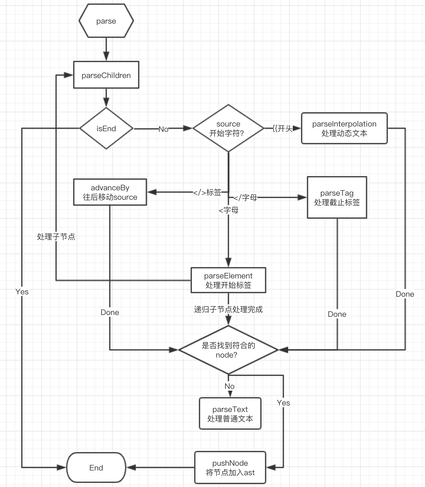
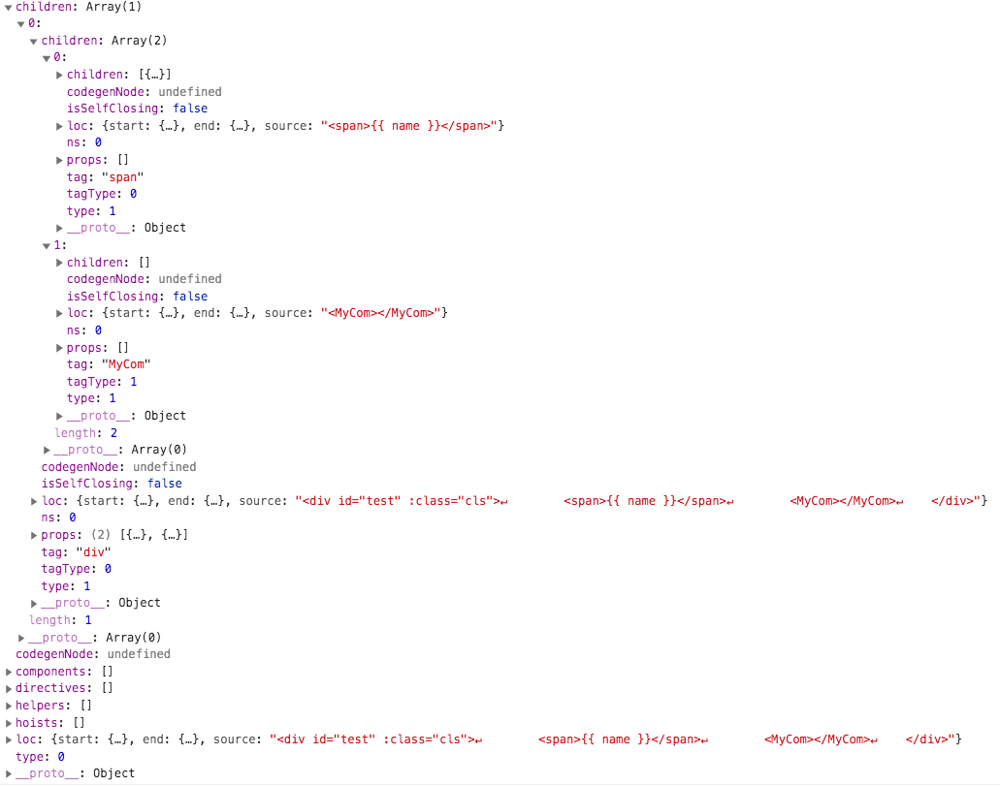

# vue3.0编译器compiler-core源码解析

Vue3的源代码正在国庆假期就这么突然放出来了，假期还没结束，陆陆续续看到努力的码农就在各种分析了。   

目前还是 pre Alpha，乐观估计还有 Alpha，Beta版本，最后才是正式版。   

话不多说，看 [Pre-Alpha](https://github.com/vuejs/vue-next)。   
瞧 [compiler-core](https://github.com/vuejs/vue-next/tree/master/packages/compiler-core)   

本文一起来解读一下 ”冷门“ 的 compiler 吧！   
如果你对 AST 还不太熟悉，或者对简单的 AST解析器 还不太熟悉，可以猛戳：[手把手教你写一个 AST 解析器](https://juejin.im/post/5d9c16686fb9a04e320a54c0)  

我们写的各种 html 代码，js使用的时候其实就是一个字符串，compiler-core 的一个核心作用就是讲字符串转换成 抽象对象语法树AST。
Let's do IT !   

## 目录结构
- __tests__ 测试用例
- src/ast   ts语法的大佬的类型定义，比如type，enum，interface等
- src/codegen   将生成的ast转换成render字符串
- src/errors    定义 compiler 错误类型
- src/index     入口文件，主要有一个 baseCompile ，用来编译模板文件的
- src/parse     将模板字符串转换成 AST
- src/runtimeHelper     生成code的时候的定义常量对应关系
- src/transform     处理 AST 中的 vue 特有语法，比如 v-if ,v-on 的解析

进入 compiler-core 目录下，结构一目了然。这里说下 __tests__ 目录，是vue的jest测试用例。  
先看看用例，对阅读源码有很大帮助哦。   

如下，测试一个简单的text，执行parse方法之后，得到 ast，期望 ast 的第一个节点与定义的对象是一致的。   
同理其他的模块测试用例，在阅读源码前可以先瞄一眼，知道这个模块如何使用，输入输出是啥。   
```js
test('simple text', () => {
    const ast = parse('some text')
    const text = ast.children[0] as TextNode
    expect(text).toStrictEqual({
        type: NodeTypes.TEXT,
        content: 'some text',
        isEmpty: false,
        loc: {
            start: { offset: 0, line: 1, column: 1 },
            end: { offset: 9, line: 1, column: 10 },
            source: 'some text'
        }
    })
})
```
   

接下来，我们开始阅读吧~~~~~~

## parse：将字符串模板转换成 AST 抽象语法树

这个是对外暴露的核心方法，我们先测试下结果：
```js
const source = `
    <div id="test" :class="cls">
        <span>{{ name }}</span>
        <MyCom></MyCom>
    </div>
`.trim()
import { parse } from './compiler-core.cjs'
const result = parse(source)
```
output:  

   

一个简单的转换结果就呈现出来了，从生成的结构来看，相对于vue2.x有几个比较重要的变化：  

1. 新增了 loc 属性
    每一个节点都记录了该节点在源码当中的 start 和 end，标识了代码的详细位置，column,line,offset。   
    vu3.0对于开发遇到的问题都要详细的日志输出也基于此，另外支持 source-map
2. 新增了 tagType 属性
    tagType 属性标识该节点是什么类型的。我们知道 vue2.x 判断节点类型是运行时才有的，vu3.0将判断提前到编译阶段了，提升了性能。  
    目前有三种类型：0 element,1 component,2 slot,3 template
3. 新增 isStatic 属性   
    将模板提前编译好，标识是否为动态变化的，比如动态指令
4. ……    

新版的 AST 明显比vue2.x要复杂些，可以看到vue3.0将很多可以在编译阶段就能确定的就在编译阶段确定，标识编译结果，不需要等到运行时再去判断，节省内存和性能。这个也是尤大大重点说了的，优化编译。    

接下来我们来看下转换的代码，主要有如下几个方法：  

- parse & parseChildren 主入口
- parseTag 处理标签
- parseAttribute 处理标签上的属性
- parseElement 处理起始标签
- parseInterpolation 处理动态文本内容
- parseText 处理静态文本内容

### parse & parseChildren 主入口
parse 的主入口，这里创建了一个 parseContext，有利于后续直接从 context 上拿到 content，options 等。   
getCursor 获取当前处理的指针位置，用户生成 loc,初始都是1。
```js
export function parse(content: string, options: ParserOptions = {}): RootNode {
  const context = createParserContext(content, options)
  const start = getCursor(context)
  return {
    type: NodeTypes.ROOT,
    children: parseChildren(context, TextModes.DATA, []),
    helpers: [],
    components: [],
    directives: [],
    hoists: [],
    codegenNode: undefined,
    loc: getSelection(context, start)
  }
}
```
重点看下 parseChildren ，这是转换的主入口方法。
```js
function parseChildren(
  context: ParserContext,
  mode: TextModes,
  ancestors: ElementNode[]
): TemplateChildNode[] {
  const parent = last(ancestors)
  const ns = parent ? parent.ns : Namespaces.HTML
  const nodes: TemplateChildNode[] = []
  while (!isEnd(context, mode, ancestors)) {
    const s = context.source
    let node: TemplateChildNode | TemplateChildNode[] | undefined = undefined
    if (startsWith(s, context.options.delimiters[0])) {
      // '{{'
      node = parseInterpolation(context, mode)
    } else if (mode === TextModes.DATA && s[0] === '<') {
      // https://html.spec.whatwg.org/multipage/parsing.html#tag-open-state
      if (s.length === 1) {
        emitError(context, ErrorCodes.EOF_BEFORE_TAG_NAME, 1)
      } else if (s[1] === '!') {
          // <!DOCTYPE <![CDATA[ 等非节点元素 暂不讨论
      } else if (s[1] === '/') {
        if (s.length === 2) {
        } else if (s[2] === '>') {
          advanceBy(context, 3)
          continue
        } else if (/[a-z]/i.test(s[2])) {
          parseTag(context, TagType.End, parent)
          continue
        } else {
        }
      } else if (/[a-z]/i.test(s[1])) {
        node = parseElement(context, ancestors)
      } else if (s[1] === '?') {
      } else {
      }
    }
    if (!node) {
      node = parseText(context, mode)
    }
    if (Array.isArray(node)) {
      for (let i = 0; i < node.length; i++) {
        pushNode(context, nodes, node[i])
      }
    } else {
      pushNode(context, nodes, node)
    }
  }
  return nodes
}
```
ancestors 用来存储未匹配的父节点，为后进先出的stack。  
循环处理 source，循环截止条件是 isEnd ，结束有两个条件：   

1. context.source为空，即处理完成
2. 碰到截止节点标签(</)，且能在未匹配的起始标签（ancestors）里面找到对对应的tag。

匹配尚未结束，则进入循环匹配。有三种情况：  
1. if (startsWith(s, context.options.delimiters[0]))  
    开始匹配到vue的文本输出内容 {{ ，则意味着需要处理 文本内容插入，
2. else if (mode === TextModes.DATA && s[0] === '<')
    内容是已 < 开头，是标签内容的标识符号，开始处理起始标签和截止标签。
3. 以上都未匹配成功
    那么就是动态文本内容了。

如果是第三种动态文本插入，则执行 parseInterpolation 组装文本节点，其中 isStatic=false 标识是变量，比较简答，方法就不贴了。   

先看下这两个处理 source 内容后移的方法：   
advanceBy(context,number) : 将需要处理的模板source ，后移 number 个字符，重新记录 loc   
advanceSpaces() : 后移存在的连续的空格   

如果是 < 开头，分两种情况：  
1. 第二个字符是 "/"   
    对应的就是 </ 
        如果是 </> ，那么认为是一个无效标签，直接 advanceBy 后移 3 个字符即可。 
        如果是 <\/a，那么认为是一个截止标签，执行 parseTag 方法处理。
2. 第二个字符是字母   
    对应就是标签的起始文字了，如 <\div，执行 parseElement 方法处理起始标签。

### parseTag 处理标签

正则：/^<\/?([a-z][^\t\r\n\f />]*)/i 这个就不多说了，匹配 <\div> <\/div>这种标签。  

测试 match ：    
```js
/^<\/?([a-z][^\t\r\n\f />]*)/i.exec("<div class='abc'>")
(2) ["<div", "div", index: 0, input: "<div class='abc'>", groups: undefined]
```
mathch[0] 即匹配到的标签元素   

```js
function parseTag(
  context: ParserContext,
  type: TagType,
  parent: ElementNode | undefined
): ElementNode {
  // Tag open.
  const start = getCursor(context)
  const match = /^<\/?([a-z][^\t\r\n\f />]*)/i.exec(context.source)!
  const tag = match[1]
  const props = []
  const ns = context.options.getNamespace(tag, parent)
  let tagType = ElementTypes.ELEMENT
  if (tag === 'slot') tagType = ElementTypes.SLOT
  else if (tag === 'template') tagType = ElementTypes.TEMPLATE
  else if (/[A-Z-]/.test(tag)) tagType = ElementTypes.COMPONENT
  advanceBy(context, match[0].length)
  advanceSpaces(context)
  // Attributes.
  const attributeNames = new Set<string>()
  while (
    context.source.length > 0 &&
    !startsWith(context.source, '>') &&
    !startsWith(context.source, '/>')
  ) {
    const attr = parseAttribute(context, attributeNames)
    if (type === TagType.Start) {
      props.push(attr)
    }
    advanceSpaces(context)
  }
  // Tag close.
  let isSelfClosing = false
  if (context.source.length === 0) {
  } else {
    isSelfClosing = startsWith(context.source, '/>')
    advanceBy(context, isSelfClosing ? 2 : 1)
  }
  return {
    type: NodeTypes.ELEMENT,
    ns,
    tag,
    tagType,
    props,
    isSelfClosing,
    children: [],
    loc: getSelection(context, start),
    codegenNode: undefined // to be created during transform phase
  }
}
```
tagType : 0 element,1 component,2 slot,3 template   
while 循环，advanceBy 去掉起始 < 和标签名之后:  
如果跟着是 > 或者 /> ，那么标签处理结束，退出循环。   
否则是标签的元素，我们执行 parseAttribute 来处理标签属性，在节点上增加props，保存 该起始节点的 attributes;   

> 执行方法后面的！，是ts语法，相当于告诉ts，这里一定会有值，无需做空判断，如   const match = /^<\/?([a-z][^\t\r\n\f />]*)/i.exec(context.source)!

### parseAttribute 处理标签上的属性

正则获取属性上的name
```js
/^[^\t\r\n\f />][^\t\r\n\f />=]*/.exec('class='abc'>')
["class", index: 0, input: "class='abc'>", groups: undefined]
```
如果不是一个孤立的属性，有value值的话（/^[\t\r\n\f ]*=/.test(context.source)），那么再获取属性的value。  
parseAttributeValue 获取属性值的方法比较容易：  

- 如果value值有引号开始，那么就找到下一个引号未value值结束 （class="aaa" class='aaa'）
- 如果value没有引号，那么就找到下一个空格为value值结束 （class=aaa）

```js
function parseAttribute(
  context: ParserContext,
  nameSet: Set<string>
): AttributeNode | DirectiveNode {
  // Name.
  const start = getCursor(context)
  const match = /^[^\t\r\n\f />][^\t\r\n\f />=]*/.exec(context.source)!
  const name = match[0]
  nameSet.add(name)
  advanceBy(context, name.length)
  // Value
  let value:
    | {
        content: string
        isQuoted: boolean
        loc: SourceLocation
      }
    | undefined = undefined
  if (/^[\t\r\n\f ]*=/.test(context.source)) {
    advanceSpaces(context)
    advanceBy(context, 1)
    advanceSpaces(context)
    value = parseAttributeValue(context)
  }
  const loc = getSelection(context, start)
  if (/^(v-|:|@|#)/.test(name)) {
    const match = /(?:^v-([a-z0-9-]+))?(?:(?::|^@|^#)([^\.]+))?(.+)?$/i.exec(
      name
    )!
    let arg: ExpressionNode | undefined
    if (match[2]) {
      const startOffset = name.split(match[2], 2)!.shift()!.length
      const loc = getSelection(
        context,
        getNewPosition(context, start, startOffset),
        getNewPosition(context, start, startOffset + match[2].length)
      )
      let content = match[2]
      let isStatic = true

      if (content.startsWith('[')) {
        isStatic = false
        content = content.substr(1, content.length - 2)
      }
      arg = {
        type: NodeTypes.SIMPLE_EXPRESSION,
        content,
        isStatic,
        loc
      }
    }
    if (value && value.isQuoted) {
      const valueLoc = value.loc
      valueLoc.start.offset++
      valueLoc.start.column++
      valueLoc.end = advancePositionWithClone(valueLoc.start, value.content)
      valueLoc.source = valueLoc.source.slice(1, -1)
    }
    return {
      type: NodeTypes.DIRECTIVE,
      name:
        match[1] ||
        (startsWith(name, ':')
          ? 'bind'
          : startsWith(name, '@')
            ? 'on'
            : 'slot'),
      exp: value && {
        type: NodeTypes.SIMPLE_EXPRESSION,
        content: value.content,
        isStatic: false,
        loc: value.loc
      },
      arg,
      modifiers: match[3] ? match[3].substr(1).split('.') : [],
      loc
    }
  }
  return {
    type: NodeTypes.ATTRIBUTE,
    name,
    value: value && {
      type: NodeTypes.TEXT,
      content: value.content,
      isEmpty: value.content.trim().length === 0,
      loc: value.loc
    },
    loc
  }
}
```
vue的语法特性，如果属性名称是v-,:,@,#开头的，需要特殊处理，看下这个正则：  
```js
/(?:^v-([a-z0-9-]+))?(?:(?::|^@|^#)([^\.]+))?(.+)?$/i.exec("v-name")
(4) ["v-name", "name", undefined, undefined, index: 0, input: "v-name", groups: undefined]

/(?:^v-([a-z0-9-]+))?(?:(?::|^@|^#)([^\.]+))?(.+)?$/i.exec(":name")
(4) [":name", undefined, "name", undefined, index: 0, input: ":name", groups: undefined]
```

mathch[2]如果有值，即匹配到了，说明是非 v-，如果是名称是[\]包裹的则是[动态指令](https://vuejs.org/v2/guide/custom-directive.html#Dynamic-Directive-Arguments)，
将 isStatic 置为 false 

#### parseElement 处理起始标签

执行 parseTag ,获取到起始节点的 标签元素和属性，如果当前也是截止标签(比如<br/>),则直接返回该标签。  
否则，将起始标签 push 到未匹配的起始 ancestors栈里面。   
然后继续去处理子元素 parseChildren ,注意，将未匹配的 ancestors 传进去了，parseChildren 的截止条件有两个：  

1. context.source为空，即处理完成
2. 碰到截止节点标签(</)，且能在未匹配的起始标签（ancestors）里面找到对对应的tag。   

因此，如果是碰到匹配的截止标签了，则需要 ancestors.pop，将节点设置为当前的子节点。   
处理当前起始节点，该节点也可能是截止节点，比如：<\img src="xxx"/>，则继续去执行处理截止节点即可。
```js
function parseElement(
  context: ParserContext,
  ancestors: ElementNode[]
): ElementNode | undefined {
  // Start tag.
  const parent = last(ancestors)
  const element = parseTag(context, TagType.Start, parent)

  if (element.isSelfClosing || context.options.isVoidTag(element.tag)) {
    return element
  }
  // Children.
  ancestors.push(element)
  const mode = (context.options.getTextMode(
    element.tag,
    element.ns
  ) as unknown) as TextModes
  const children = parseChildren(context, mode, ancestors)
  ancestors.pop()
  element.children = children
  // End tag.
  if (startsWithEndTagOpen(context.source, element.tag)) {
    parseTag(context, TagType.End, parent)
  } else {
  }
  element.loc = getSelection(context, element.loc.start)
  return element
}
```

至此，vue3.0的 将 模板文件转换成 AST 的主流程已经基本完成，静待下篇，AST 的 transform 处理。


